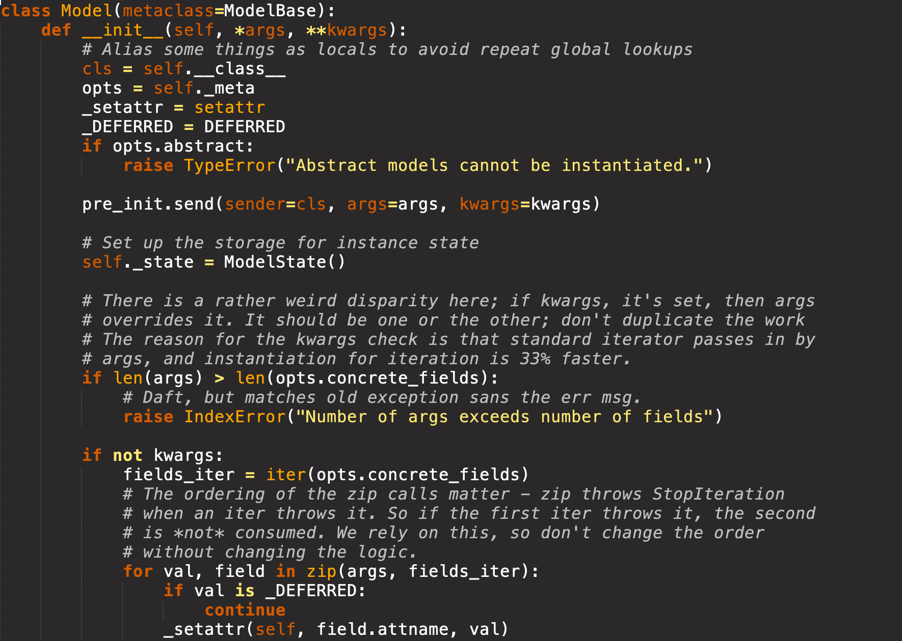
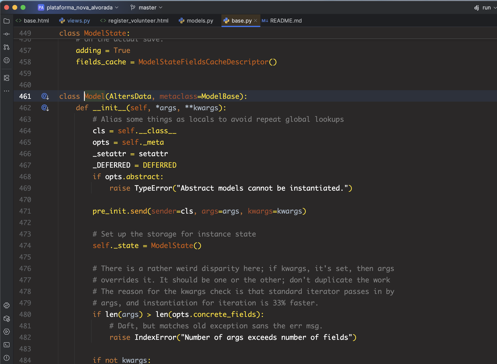

# Dawn Theme

Dawn é um tema escuro e minimalista que evoca a suavidade do amanhecer, com uma paleta equilibrada projetada para destacar a sintaxe sem cansar a visão. Ideal para longas sessões de programação, combina tons suaves e alto contraste.

---

## Visualizações de Exemplo
<p style="text-align: center">
  
  
</p>

## Paleta de Cores
<p style="text-align: center;">
  
</p>
> **Dica**: Consulte o arquivo de tema para ver os valores exatos em HEX e adaptar a personalização conforme seu gosto.

---

## Instalação

### JetBrains IDEs
1. **Abra** seu IDE JetBrains (IntelliJ IDEA, PyCharm, WebStorm etc.).
2. **Acesse** `Settings/Preferences`:
   - macOS: `⌘,`
   - Windows/Linux: `Ctrl+Alt+S`
3. **Vá** em **Plugins** e clique em **Marketplace**.
4. **Busque** por **Dawn Theme** e clique em **Install**.
5. **Reinicie** o IDE.
6. **Aplique** em `Settings/Preferences → Appearance & Behavior → Appearance`:
   - Em **Theme**, selecione **Dawn Theme**
   - Clique em **Apply** e **OK**.

#### Instalação Manual (JetBrains)
1. Faça download do `.jar` em `Dawn-JetBrains` no repositório.
2. Em `Settings/Preferences → Plugins → ⚙️ → Install Plugin from Disk…`, selecione o `.jar`.
3. Reinicie e aplique o tema conforme passo 6 acima.

---

### Sublime Text
#### Via Package Control
1. **Instale** o **Package Control** (se ainda não tiver):
   - Abra o console (`Ctrl+\`` ou `View → Show Console`).
   - Cole o script de instalação em https://packagecontrol.io/installation e execute.
   - Reinicie o Sublime Text.
2. **Abra** a **Command Palette** (`Ctrl+Shift+P` ou `Cmd+Shift+P`).
3. Selecione **Package Control: Install Package**.
4. Busque **Dawn Theme** e instale.
5. Em `Preferences → Settings`, adicione no User Settings:
   ```json
   {
     "theme": "Dawn.sublime-theme",
     "color_scheme": "Packages/Dawn Theme/Dawn.tmTheme"
   }
   ```
6. **Salve** e aproveite o tema.

#### Instalação Manual (Sublime Text)
1. Copie a pasta `Dawn Theme` para:
   - **Windows**: `%APPDATA%\Sublime Text\Packages\`
   - **macOS**: `~/Library/Application Support/Sublime Text/Packages/`
   - **Linux**: `~/.config/sublime-text/Packages/`
2. Aplique o tema no `Preferences → Settings` conforme passo 5 acima.

---

## Personalização
- **Colors**: ajuste os valores HEX diretamente no arquivo de tema.
- **Fonts e tamanhos**: altere as configurações do editor para combinar com o estilo Dawn.
- **Additional tweaks**: veja a documentação oficial de cada plataforma para opções avançadas.

---

## Problemas Comuns
- Verifique se o editor está na versão mais recente.
- Confirme conflitos com outros temas/plugins.
- Reinicie o editor após a instalação.

---

## Suporte
Abra uma issue no GitHub: https://github.com/seu-usuario/dawn-theme

